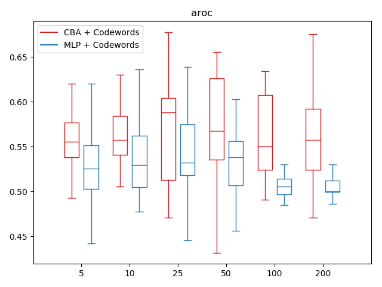

# Codeword Bernoulli Average

BORGES, R. C.; QUEIROZ, M. . Automatic Music Recommendation Based on Acoustic Content and Implicit Listening Feedback. Revista Música Hodie, [S.l.], v. 18, n. 1, p. 31 - 43, jun. 2018. ISSN 1676-3939.

(https://doi.org/10.5216/mh.v18i1.53569	)

Dataset available at https://www.ime.usp.br/~rcborges/bpmd
